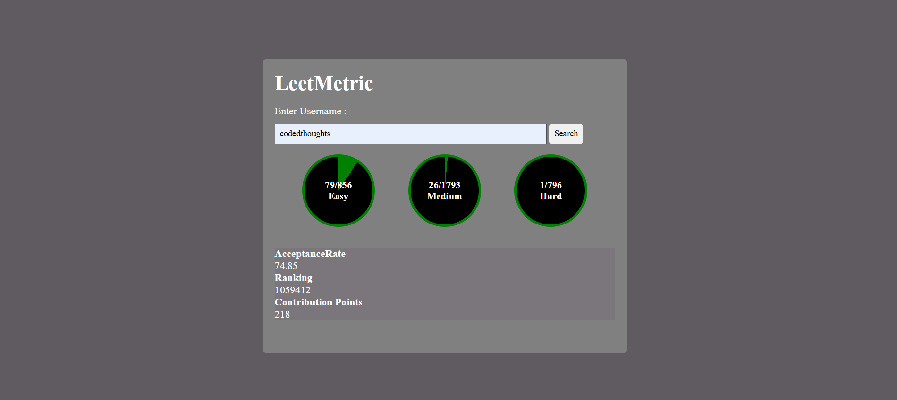

# LeetMetric
This project is the implementation of CodeHelp by Love Babbar's JavaScript Course. This project helps to understand the use of WebAPI's and Functionalities of JavaScript

# API Used
API = https://leetcode-stats-api.herokuapp.com/{username};

# This is how it looks like...

